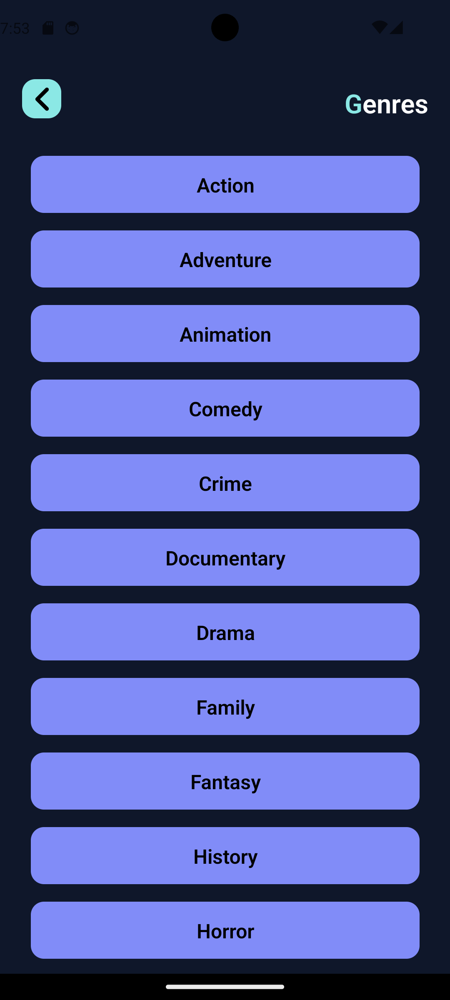
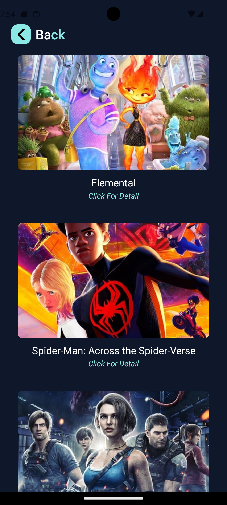
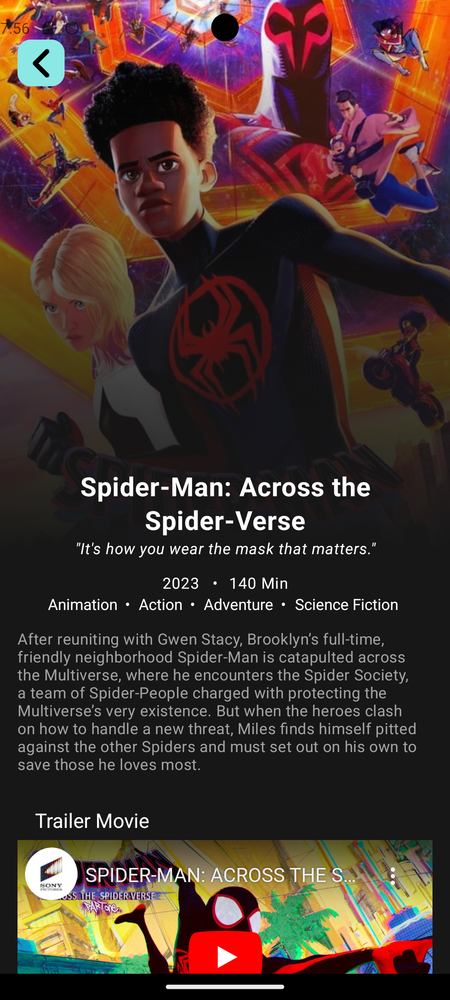
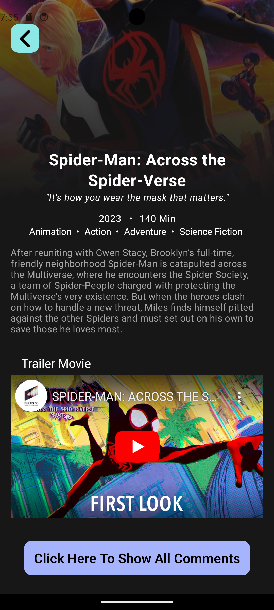

# Fetching The Movie Database API Using React Native

## Technologies Used

- React Native
- The Movie DataBase (TMDb) API
- Axios for API requests
- React Navigation for routing
- YouTube API for embedding trailers

### 1. Display List of Official Genres

Browse through a clickable list of official movie genres to discover movies based on specific genres.

### 2. Discover Movies by Genre

Explore a collection of movies categorized by genres. Click on a genre to view a list of movies associated with that genre.

### 3. Movie Details

View primary information about a selected movie, including its title, release date, overview, and average user rating.

### 4. Watch Youtube Trailer

Watch the YouTube trailer for a selected movie directly within the app.

### 5. User Reviews

Read user reviews and ratings for a movie to get insights into other viewers' opinions.

## Screenshots

## Screenshots

Home Screen            |  Genres Screen            |  Discover Movies Screen
:-------------------------:|:-------------------------:|:-------------------------:
  |    |  

Movie Details Screen         |  YouTube Trailer         |  User Comments Screen
:-------------------------:|:-------------------------:|:-------------------------:
  |    |  

